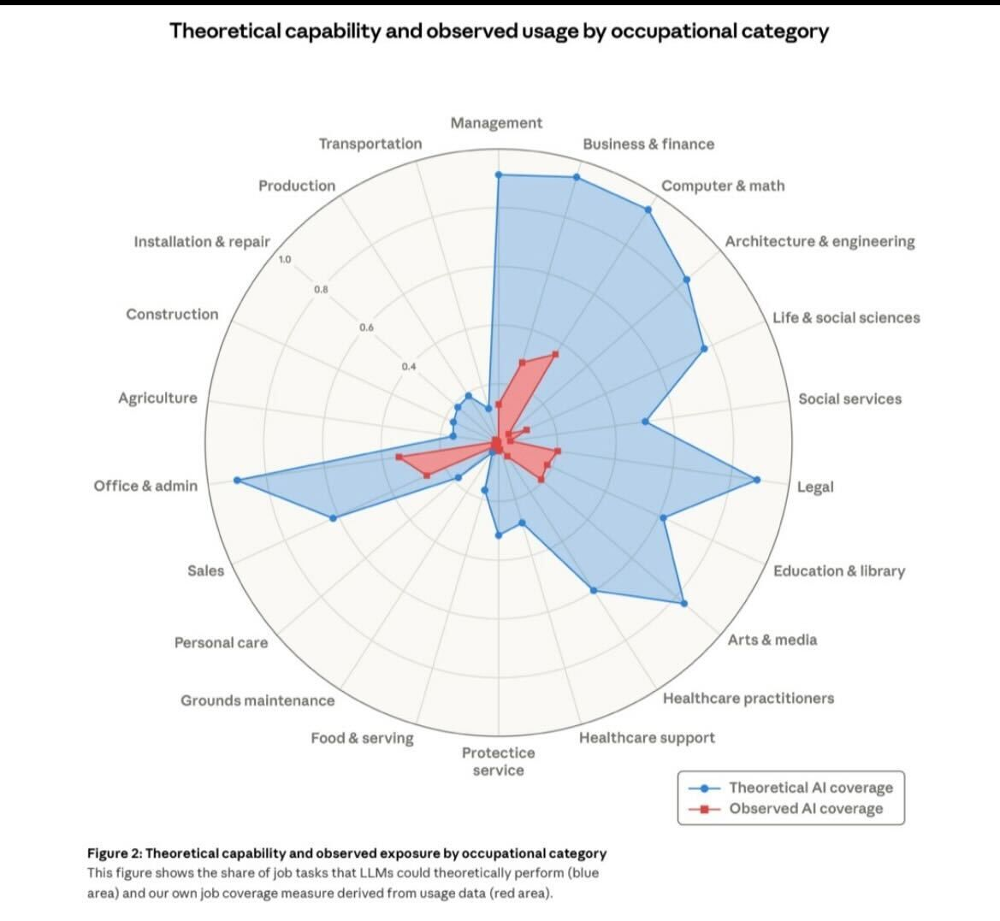

> \> enter. Mando el prompt largo y detallado que explica lo que quiero y cómo lo quiero. La máquina que tengo enfrente lee todos los archivos de mi proyecto y me propone el modo “plan”. Esto puede demorar un poco, así que cambio de ventana y voy a perder un rato en algún scroll infinito mientras la IA ve cómo resolverá la tarea.

Veo pasar en las diferentes redes sociales cientos de publicaciones sobre el presente y el futuro de los trabajos afectados por la IA, acompañadas de una gráfica impactante. Hace dos días, la empresa detrás de Claude, Anthropic, publicó un reporte[^1] del impacto observado y esperado de la IA en los diferentes tipos de trabajo. El reporte plantea lo que hace rato es intuición: corre más riesgo el trabajador de cuello blanco que realiza tareas repetitivas —incluidos, especialmente, los programadores— que el trabajador que maneja oficios. Y aparentemente en este tipo de tareas, lo que más peligra es la contratación de perfiles junior, es decir, los más jóvenes.

> \> aguante la UTU. En momentos así me acuerdo de las palabras sagradas de los viejos: lo más importante es aprender un oficio; después ves. Y acá estamos.

Hace unas semanas el tipo que acuñó la expresión “vibe coding” comentó lo difícil que es explicar el cambio cualitativo que se vivió en las tareas de programación entre diciembre del 2025 y hoy: delegar tareas complejas de programación a agentes de IA no funcionaba tan bien hasta diciembre, y ahora simplemente funciona[^2] . Él tiene un montón de peros a su propia afirmación, pero algo de razón tiene: cada vez más de mis horas de trabajo son sobre dar buenas instrucciones y prompts, coordinar a varios agentes haciendo cosas distintas al mismo tiempo y gestionar las dependencias entre el trabajo de uno y de otro mucho más que escribir código. Me encuentro trabajando más horas que antes, no menos, porque ahora el espacio de lo posible se ensancha: y si me quedo un ratito más, puedo lograr mucho más. El lenguaje de programación más popular es el inglés, dice Karpathy[^3] , y de nuevo tiene razón.

> \> pensando. En realidad la IA —a veces Claude, a veces Codex— no “ve” ni piensa nada; simplemente opta por cada camino que maximice la chance de que yo quede contento. Recorre con dedicación todos los caminos posibles buscando respuestas optimizadas para mi aceptación, no siempre para la mejor solución.

Hace unos días en USA la misma empresa del artículo le puso un límite grandilocuente al Departamento de Defensa de los Estados Unidos sobre el uso de sus modelos en armas teledirigidas y vigilancia interna[^4] (causando simpatía en usuarios y aumentando suscripciones), el gobierno se enojó y amenazó con ponerlos en una lista negra de compras federales. La empresa competidora (OpenAI \- ChatGPT) fue y les sacó el contrato. Días después, el CEO de Anthropic salió a disculparse[^5] ; parece un capítulo más de la serie CEOs desesperados.

> \> plan listo. Claude, Claudio para los amigos, me da un plan detallado de lo que va a implementar. Lo tengo que revisar atentamente, corregir, señalar inconsistencias con frases que me hacen sentir medio patroncito —“¡no me entendiste\!”— y entonces hace que piensa y dice: “¡Absolutamente\! Tenés razón”. ¡Basta, Claudio\! No quiero tener razón todas las veces.

Estos movimientos de las empresas —levantar ciertas banderas, poner algunos límites, decir como al pasar que no están seguros de si un modelo de lenguaje tiene conciencia o no[^6] , o publicar artículos de investigación aparentemente neutrales— lejos están de ser motivados por criterios éticos. Son simplemente gestos diseñados para complacer a inversionistas cuyo humor hace subir y bajar acciones en mercados cada vez más volátiles. Un péndulo de humo que oscila entre encantadores de serpientes y asustaviejas: lo que sea que le sirva al mercado.

> \> implementación lista. Claude me entrega una primera versión de su trabajo; usa un lenguaje que transmite orgullo, pero no anda de una. Arreglo dos bobadas y después, más o menos, funciona sorprendentemente bien. Miro los tokens, veo cuánto gasté y le pido a Codex que evalúe y corrija el trabajo de su compañero. Un poco de competencia sana entre los juniors mientras pienso qué viene después. No puedo evitar sonreír con lo que tengo enfrente; con vergüenza, reconozco estar un poco fascinado. Quizá debería reflexionar un poco sobre esto.

Pareciera que estamos en una tormenta perfecta de innovación muy real y accesible en el marco de una industria que es naturalmente inflacionaria: lo que hace plata no es lo que es, sino la promesa de lo que puede ser. El "fake it until you make it" se ha convertido en dogma empresarial. Y así están todas las empresas globales, locales, y hasta unipersonales como yo, viendo entre el pánico y la fascinación qué decisión drástica tomar hoy para no quedar atrás mañana.

> \> tests pasan. Claudio y Codex se ponen de acuerdo y tengo un PR listo para pasárselo a los humanos para las pruebas. No estoy laburando en nada muy difícil, pero tampoco era trivial. Me hubiera llevado dos o tres semanas a las risas y lo que tengo enfrente está mejor terminado y llevó 4 hs. No hay con qué darle.

Sobre el trabajo e IA vamos a leer todo tipo de conclusiones acompañadas de exactamente la misma gráfica; algunas recorrerán el camino del optimismo tecnológico donde la IA solo ayudará a resolver problemas. Algo infantil, al estilo cripto bro. Otros abonarán la visión de catástrofe donde las máquinas toman conciencia y se vuelven contra nosotros. Algo ridículo y paralizante. La gráfica es difícil de desver: el cambio llegó hace rato y no solo para los trabajadores de la tecnología.

> \> hoy no escribí una línea de código. ¿Qué significa esto para nosotros, los asalariados de esta profesión, y para los de esta y la siguiente generación? ¿Y la anterior? Me pregunto qué significa todo esto para nosotros, los de acá.

Mientras tanto, en Uruguay empiezan a aparecer algunos debates —todavía tímidos— sobre la IA: guías para el contexto educativo terciario[^7] , ideas de regulación[^8] , agenda parlamentaria[^9] y conversaciones más que interesantes sobre el impacto en la educación de los más chicos[^10] . La forma de trabajar cambia, la forma de educar y educarse cambia, la forma de relacionarnos cambia, y aparecen las preguntas.

¿Por dónde debería ir el Estado en sus necesidades más inmediatas? ¿Cuál debería ser la visión, la inversión y el criterio frente a cada venta legítima y cada venta de humo que intentarán los proveedores de IA?

¿Cómo manejarán los departamentos de TI el uso de IA por parte de funcionarios con o sin estrategia definida? ¿Cómo se suma esto a los ya complejos desafíos en materia de seguridad informática?

¿Qué garantías tendrán los trabajadores cuando una estrategia de uso de IA finalmente se defina? ¿Cómo se repartirán la culpa y las responsabilidades cuando las cosas salgan mal? ¿Iniciaremos sumarios e investigaciones internas sobre la IA, los usuarios o los proveedores?

Si se confirma la tendencia de que el problema no es solo la pérdida de puestos de trabajo, sino su transformación, ¿cuáles serán los reclamos sindicales? ¿Menos IA? ¿Más IA? Mejor IA?

¿Dónde queda la discusión de soberanía que ya no es solo de infraestructura ni solo de datos? ¿Quién participa en esa discusión? ¿Y dónde se da?

Las preguntas son abrumadoras, pero es bueno recordar que la IA no es un fenómeno climático, ni un desastre natural, ni un animal mitológico. Se trata de otro invento humano que puede ser explicado y entendido, que opera bajo las mismas reglas del sistema en el que vivimos y cuyos efectos negativos impactarán, como siempre, a aquellos que el sistema elige dejar de lado.

La tecnología nunca es neutra. Las acciones políticas, regulatorias y de gobierno pueden —y deben— orientar, y de ser necesario corregir, los rumbos de su aplicación. La mano del mercado, hoy más visible que nunca, puede ser fuerte, pero no podemos renunciar a la pulseada.

> \> más layoffs. Entro a portales de noticias y leo sobre los despidos, los recortes, los cambios de planes, la cancelación de proyectos por las dudas, mucha gente en banda. Hoy les toca a ellos, pero las bombas caen cada vez más cerca.

Quizá las amenazas que presenta la IA son todas plausibles, pero no todas son igual de probables. Definitivamente también hay oportunidades y, en este como en todos los temas, muchos rincones de soberanía para disputar.

> \> el límite se reseteará a las 20 hs. Bueno, los agentes se cansaron y me obligan a parar por hoy, pero sé que algún tecno optimista está en este momento intentando vender un proyecto de IA para, no sé, resolver la pobreza infantil o algo así. Espero que ellos también encuentren algún límite.

[^1]:  [https://www.anthropic.com/research/labor-market-impacts](https://www.anthropic.com/research/labor-market-impacts)

[^2]:  [https://x.com/karpathy/status/2026731645169185220?s=20](https://x.com/karpathy/status/2026731645169185220?s=20)

[^3]:  [https://x.com/karpathy/status/1617979122625712128?s=20](https://x.com/karpathy/status/1617979122625712128?s=20)

[^4]:  [https://www.anthropic.com/news/statement-comments-secretary-war](https://www.anthropic.com/news/statement-comments-secretary-war)

[^5]:  [https://www.instagram.com/reels/DVh1Vbnjmc-/](https://www.instagram.com/reels/DVh1Vbnjmc-/)

[^6]:  [https://futurism.com/artificial-intelligence/anthropic-ceo-unsure-claude-conscious](https://futurism.com/artificial-intelligence/anthropic-ceo-unsure-claude-conscious)

[^7]:  [https://www.fing.edu.uy/sites/default/files/2026-02/guia-de-etica-fing\_2026.pdf](https://www.fing.edu.uy/sites/default/files/2026-02/guia-de-etica-fing_2026.pdf)

[^8]:  [https://www.gub.uy/agencia-gobierno-electronico-sociedad-informacion-conocimiento/comunicacion/publicaciones/estrategia-nacional-inteligencia-artificial-uruguay-2024-2030/principios](https://www.gub.uy/agencia-gobierno-electronico-sociedad-informacion-conocimiento/comunicacion/publicaciones/estrategia-nacional-inteligencia-artificial-uruguay-2024-2030/principios) 

[^9]:  [https://ladiaria.com.uy/futuro/articulo/2026/2/por-primera-vez-inteligencia-artificial-y-tecnologia-estan-en-el-centro-de-la-agenda-legislativa-de-gobierno-y-oposicion/](https://ladiaria.com.uy/futuro/articulo/2026/2/por-primera-vez-inteligencia-artificial-y-tecnologia-estan-en-el-centro-de-la-agenda-legislativa-de-gobierno-y-oposicion/)

[^10]:  [https://www.elobservador.com.uy/opinion/la-infancia-la-educacion-y-una-coartada-comoda-no-es-solo-la-pantalla-n6036313](https://www.elobservador.com.uy/opinion/la-infancia-la-educacion-y-una-coartada-comoda-no-es-solo-la-pantalla-n6036313) 