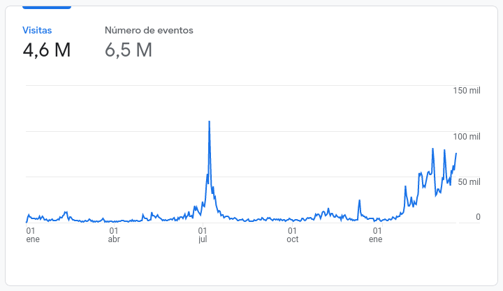
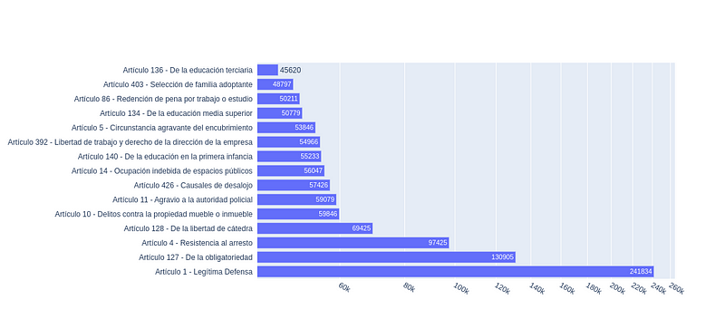

Leí en algún lado que la democracia se parecía mucho a la técnica matemática de reducción de dimensionalidad. Es normal en Ingeniería y otras disciplinas intentar convertir un problema de muchas variables, en otro más digerible, con menos, aún sabiendo que en el proceso se pierden detalles e información. Se trata de simplificar problemas para procesarlos con las herramientas que tenemos, o visualizarlos, o entenderlos.

La democracia que nos hemos dado parece funcionar de manera similar. Simplificar las ideas de miles personas en las ideas de un representante. Simplificar posiciones de millones en posiciones de decenas de partidos, y en el caso de los referéndums simplificar un largo proceso legislativo en dos simples opciones: Si, o No.

Tener en una Ley Urgente de más de quinientos artículos, que determinan políticas clave en más de 15 áreas y, más tarde, un Referéndum con sólo dos posiciones para resolver sobre 135 artículos, debe ser la máxima expresión de simplificar temas complejos para ser capaces de procesarlos.

Estas son las herramientas que tenemos, ¡y por suerte las tenemos! Sin embargo, en estos días, y un poco pasando raya a dos años de discusión pública sobre la LUC, toma relieve un nivel más de simplificación de las cosas: el color de las papeletas, las mascotas de cada campaña, las mentiras que se repiten por dirigentes y militantes aún cuando fueron mil veces desmentidas.

Esa simplificación no es necesaria para procesar los temas, subestima a la gente, desprestigia la política, y erosiona la democracia. Pero también hay otra forma de hacer las cosas: ciertos debates contrastables, algún periodismo serio que intentó procesar los temas sin quitarles complejidad, militantes yendo a discutir con papelitos en la mano y gente que ha intentado, no siempre con suerte, informarse bien.

Mientras se discutía la LUC en el parlamento, a las apuradas y entre pocos, quedaba claro que se necesitaba un recurso claro y accesible para que quienes quisieran pudieran ver los cambios que la LUC introdujo a la legislación. No los cambios que los promotores y detractores decían que se hicieron, sino los cambios textuales.

Más adelante, con la ley aprobada y con varias organizaciones dispuestas a comenzar la recolección de firmas, quedaba claro que además necesitábamos un material que ante la pregunta, ¿qué dicen los 135 artículos? que tantas veces encontramos juntando firmas, se pudiera responder, entrá acá y miralos vos.

Es así que surge la LUC Comparada, un sitio en internet que toma datos del Impo, les aplica un diff (una herramienta que los informáticos usamos mucho para comparar versiones de software) y logra mostrar con colores exactamente qué cambió en la ley. Era lo que entre varios entendimos que se necesitaba para una ley que cambiando palabras aquí y allá, cambiaba mucho más que palabras.

Esta página, que necesitábamos fuera rápida y simple, que se podía instalar como app en el teléfono (porque aparentemente las apps gustan) recibió desde diciembre del 2021, 4.6 millones de visitas. Ese número en sí no es muy informativo porque podríamos haber pautado publicidad (que no lo hicimos, porque además con qué), pero sí es interesante observar de dónde vinieron las visitas, o mejor, desde donde no vinieron.

Evolución de visitas a resistencia.uy

Entre Enero y Abril de 2021 la página recibió 3% de tráfico desde _yofirmo.uy_, 20% de tráfico desde Twitter y Facebook y 60% de tráfico directo. Lo que podemos suponer de ese tráfico directo, ya que el link no fue publicitado en ningún medio, es que la página empezó a circular por Whatsapp y boca a boca y no desde sitios ni cuentas oficiales de partidos u organizaciones.

En algún punto la página de la LUC Comparada, [resistencia.uy](/links/resistenciauy/), pasó a ser el primer resultado de Google ante la búsqueda de la palabra “LUC” y desde el 1o de Mayo hasta ayer, el 53% de las visitas llegaron desde Google, 25% es tráfico directo y 12% de Twitter y Facebook.

No es posible saber exactamente cuántas personas diferentes visitaron la página pero si sabemos que las visitas corresponden a 340 mil usuarios (que pueden ser personas diferentes, o personas que usan más de un dispositivo) que pasaron alrededor de 4 minutos en promedio leyendo sobre la LUC.

Los 15 artículos más consultados

A pesar del nombre de la página (resistencia.uy es un dominio un poco zurdo que tenía de antes y en el apuro terminamos usando) el material fue usado tanto para defender los artículos (por parte incluso de integrantes del gobierno), como para atacarlos. No puedo asegurar que en todos los casos anexar el texto de la ley a las discusiones haya subido el nivel de la conversación pero ojalá haya aportado en la dirección contraria a la del griterío.

Escribo hoy sobre este proyecto, no porque sea interesante técnicamente (qué no lo es para nada) sino porque creo que logró mostrar que cuando la información existe y es accesible, la información se usa, y se usa bastante. Creo además que cuando se usa información para discutir, las posturas son más razonables, y la democracia de mayor calidad.

La otra razón para escribir esto es porque hay aprendizajes en el proceso, y muchas personas a las que agradecer. Desde la idea inicial que salió de una conversación de twitter pasando por la gente que ayudó a corregir errores, quienes se ocuparon del diseño, quiénes fueron tirando buenas ideas y unas cuántas críticas, quiénes compartieron un link una y otra vez. Todxs demostraron que se puede hacer mucho entre muchos, siempre que haya ganas, y en este caso: datos abiertos, y software libre.

Este proyecto nunca pretendió ser neutral, ni oficial, ni anónimo. Fueron algunas horas voluntarias de lectura, programación, diseño e intercambio en medio de cuarentenas y trabajo remoto, pero siempre intentando desde un lugar de compromiso e identificación clara (💗) subir un poco el nivel.

Ojalá podamos votar el 27 con la mayor independencia de criterio posible, porque al final lo que hay que resistir son formas egoístas de hacer política, de quiénes primero simplifican a niveles ridículos la realidad para después creer, olvidadizos, en sus propias construcciones.

Después de todo, resistencia.uy, como idea, no está tan mal.