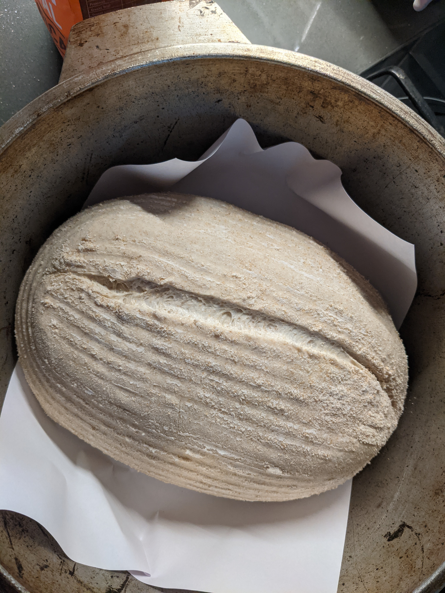
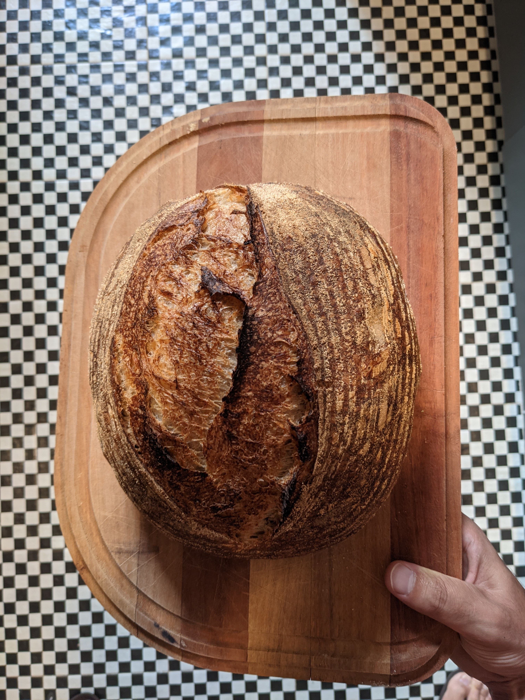

Sin mucha perolata va una variante de el [pan anterior](/recetas/el-definitivo/) aumentado un poco el agua y la proporción de harina integral. Quedó de rechupete.

Con esta hidratación (70%) aguantó bien directo en el molde toda la noche sin pegarse y sin desarmarse cuando lo saqué.

