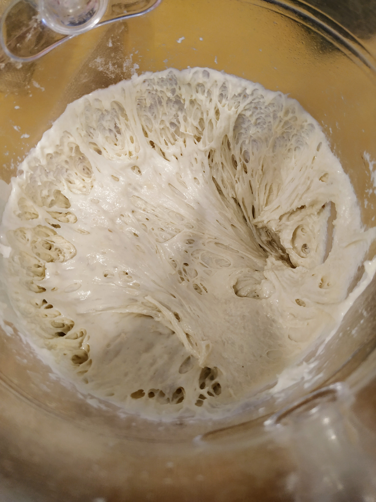
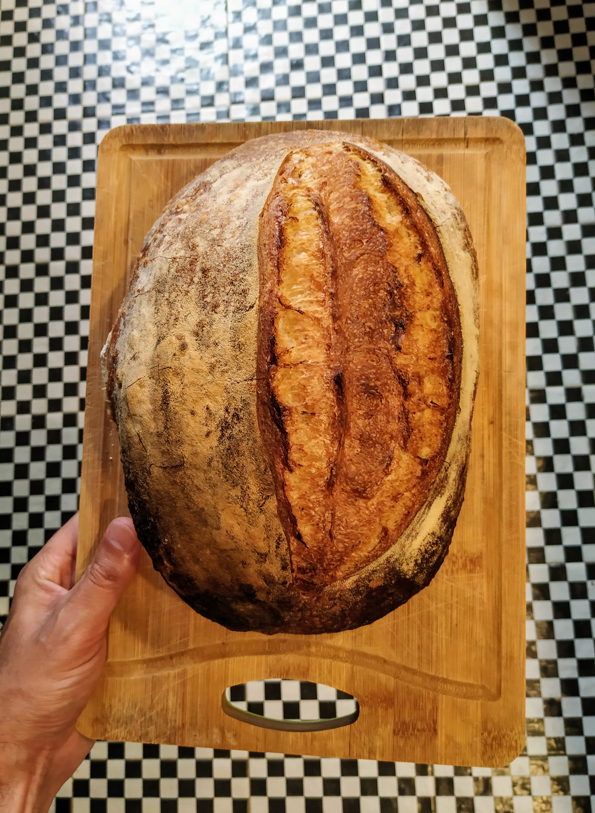

Bueno, ha pasado un tiempo desde el último post. Primero, hay que hacer menos pan porque los kilos no ayudan, segundo, estuve un poco obsesionado con lograr mayor hidratación sin resultados maravillosos y tercero, el coronavirus había aflojado y había otras actividades. 

Pero, a 400 casos nuevos por día y guardado nuevamente en casa acá va:

Volví a la receta que me había quedado mejor, pero esta vez usé una harina importada con bastante proteína que la verdad cambia bastante y para bien la textura y la miga.

La masa madre que usé esta vez es mucho más sólida que la de siempre, la razón es que con la misma preparación voy a intentar hacer también Pan Dulce o Panettone (si sale bien lo publicaré, sino nunca más hablaremos del tema). Que sea más solida simplemente es echar menos agua, yo no noté menos crecimiento ni nada por el estilo, de hecho me gustó más:

La receta no tiene misterio, está más abajo y me dió para dos panes grandotes que, esta vez (la razón? no hay razón), fueron juntos en una bandeja al horno, y debajo otra bandeja a la que le eché un gran vaso de agua para que genere vapor y no se reseque el pan antes de tiempo.

La gran ventaja de esta receta, con esta hidratación, es que el pan realmente mantiene la forma del molde, y te da el tiempo para hacerle los cortes sin que se desmorone.

Creció mucho verticalmente y resultó en la mejor miga que he logrado hasta el momento, qué tal?

