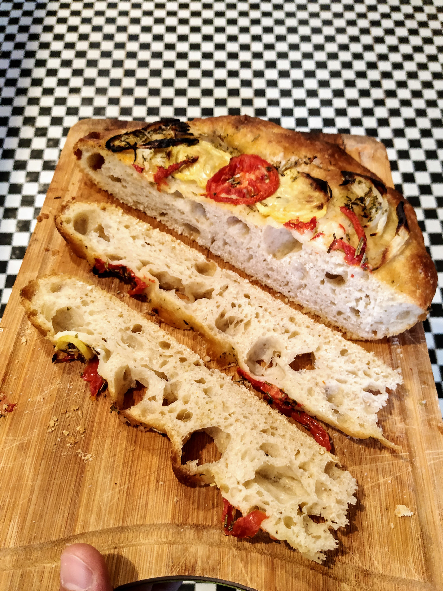

Bueno vengo intentando hacer una de estas hace rato y nunca me convence del todo. Hasta hoy!

No hay mucho misterio, harina, agua, sal y:

* Cebolla
* Zucchini
* Tomate
* Oliva
* Romero

Hay mil videos explicando como meter los dedos llenos de aceite de oliva por encima de la masa sin romper las burbujas. Pero es eso nomás, enchastrarse un poco.

La receta dice que se puede hornear el mismo dia de la preparación, en mi caso me fuí al cine y la dejé en la heladera toda la noche y resultó en un gran Brunch.

