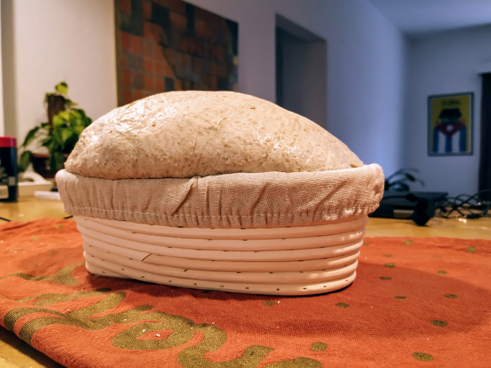
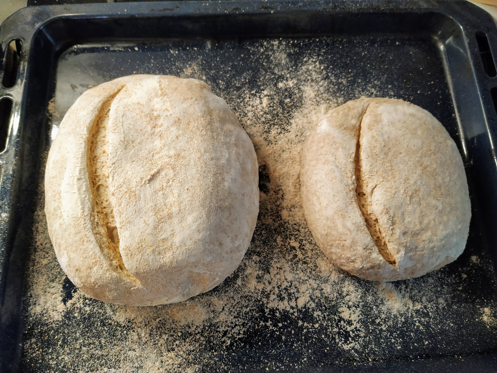
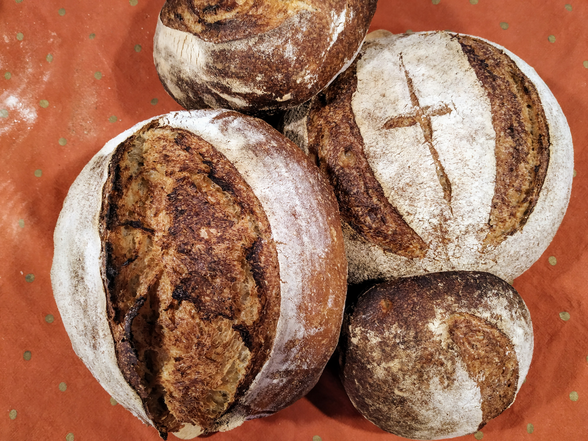
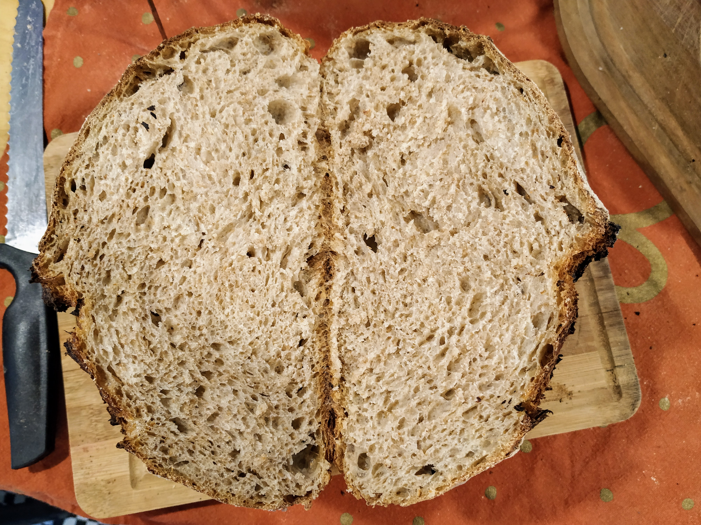

Pan integral, receta al final del post, en el divague que sigue mis aprendizajes.

## Jueves

### 8am

Saco la MM de la heladera, de su tarro habitual paso 100gr a un recipiente más grande, agrego 50gr de integral, 200gr de harina blanca y 200 de agua.

x = 50gr

MM Refrescada = 2x MM + 1x Integral + 4x Blanca + 4x Agua = 550g

Se supone que esta MM va a crecer relativamente lento, y está como "chota" o dormida por haber estado en la heladera. Por eso vamos a tirar casi todo para hacer un nuevo refresco mañana. Puede ser que crezca como loca en pocas horas y no sea necesario hacerlo dos veces. Uno va viendo (y anotando)

## Viernes

### 8 am

Tiro 450gr de MM aprox del recipiente que estoy usando (grandecito, tipo balde) y me quedo con 100gr (x=100 lo que me dá un total de 1kg de MM, es mucho pero voy a hacer dos recetas grandes. Se varía a gusto, tiene que alcanzar para cocinar y un poquito para guardar). Acá innové y puse más centeno y creció muy rápido.

### 2pm

La MM me grita que la use y no quiero que empiece a bajar, asi que:

Ya que el pan anterior quedó muy decente y quedé conforme con esa proporción de agua, quería hacer algo más integral y adapté dos recetas: La de Ken (Country Brown) pero con un poco menos de agua. Y [la receta anterior](/recetas/pan-centeno-pura-mm/) pero cambiando 100g de harina blanca por integral.

### 23pm

## Sábado

### 9am

Los panes están en el horno, es hora de guardar los aprendizajes.

* A mi MM la refresqué (en la pre-receta) con más harina de centeno todavía. Creció de forma increíble y en 6 horas estaba amasando. Esta vez cuando la llevé a la heladera no siguió creciendo (que si me ha pasado antes), lo que me indica que realmente estaba en su punto máximo. Además hay 17 grados 🔥
* Se nota mucho la presencia de la harina integral especialmente en la acidez y en la miga que es más compacta y  esponjosa. Obviamente cambia el color y sabor.

Hoy hice dos recetas:

La que dejo al final, es un pan con bastante harina integral e hidratación del 75%. No creció tanto verticalmente, ni se abrió demasiado a causa del corte. Pero quedó redondito, un poco ácido y lindo. Es como que es muy rico pero no muy fotogénico el pobre. (en la foto de abajo es el de la cruz medieval 😬)

El otro, que es el mismo que [acá](/recetas/pan-centeno-pura-mm/) pero con algo de harina integral, además de centeno, quedó muy bien. Más suave en sabor, no tan ácido, más altito y más amigo de instagram. Este es un pan de menos hidratación, 67%, que no sufrió en nada la harina integral.

Que hubiera pasado si al primer pan le ponía centeno? Y si al segundo le agregaba más agua? Estas y más preguntas serán respondidas en el próximo capítulo. 🧐

## Porcentaje Panadero.

Esto es un poco nerd, podés saltearlo sin problemas.

Casi toda la gente que sabe usa el porcentaje Panadero, qué no es otra cosa que expresar los ingredientes en función del total de harina y no del total de ingredientes (en las tablas que pongo acá uso porcentaje sobre el total de los ingredientes). La idea es que sea fácil comparar recetas y cambiar las cantidades.

O sea, siempre el 100% va a ser el total de harinas usadas, todo lo demás es un porcentaje de eso. Es importante porque en general una receta se caracteriza por el porcentaje de hidratación, o sea de agua, y cuando te dicen 74% de agua uno dice **Whaaaaat!** pero porque no sabe de lo que le están hablando.

Hay calcular cuánto aporta de harina la masa madre, en mi caso mi MM está hidratada al 80%, quiere decir que tiene 80% de agua respecto al 100% de harina. El "problema" (hace una hora estoy haciendo cuentas) es que siempre la masa madre parte de un poco de masa madre anterior y bueno... la conclusión es que en esta casa y en este blog la masa madre siempre tiene un 54% de harina en el total del peso y un 43% de agua aprox.

### Mis cálculos:

Masa Madre para receta = **MMr**

**MMr** = 0.1 **MMf** + 0.4 Harina Blanca + 0.1 Harina Integral + 0.4 Agua

**MMr** = 0.1 **MMf** + 0.5 Harinas + 0.4 Agua

Masa Madre refrescada después de heladera = **MMf** 

**MMf** = 0.2 **MMr** + 0.1 Harina Integral + 0.4 Harina Blanca + 0.4 Agua 

**MMf** = 0.2 MMr + 0.5 Harinas + 0.4 Agua

En la refrescada usé dos partes de la que tenía en la heladera, y esa fue de una receta anterior así que tiene las mismas cantidades que **MMr**. Hacemos unas cuentitas y:

**MMr** = 0.54 Harinas + 0.43 Agua (más o menos, pobres decimales)

**Entonces**: si una receta lleva 225 gr de MM, la MM aporta 225\*0.54 = 122gr de Harina a la masa final y 225\*0.43 = 97gr de Agua. Sumás las harinas de la receta, y de la masa madre y ese es el 100%. 

Para todo lo demás, regla de tres. 💅🏻
