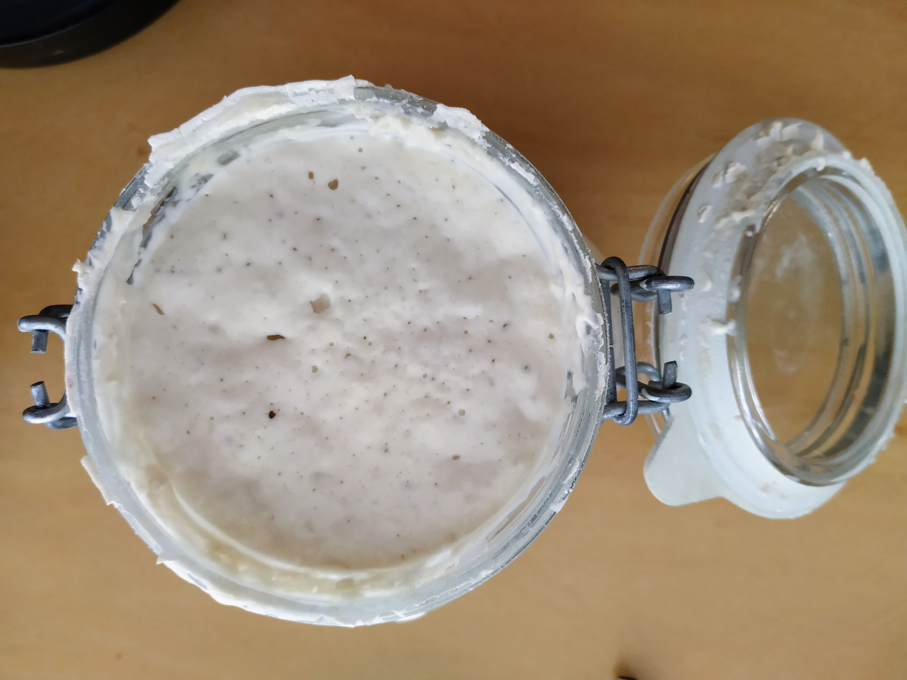

### Masa Madre, Sourdough, Levain  
  
Bueno esta es literalmente la madre del borrego. Es el cultivo natural de levaduras y bacterias que surge del fermento de agua y harina.  Es más viejo que matusalem y se usa para hacer esos panes ricos y llenos de agujeros de instagram. Yo arranqué la mía unos días después de empezar la cuarentena voluntaria. Mi amiga Paula me pasó los piques pero estuve unas semanas en vueltas un poco fallidas hasta lograr algo. O sea que no voy a explicar cómo se hace porque no tengo el método claro, pero siempre se puede googlear, o pedir un poco a alguien que ya haya pasado por esa etapa. Le pueden poner nombre, la mía se llama Paula Cuarentena y data del 24/3/2020.

#### Heladera

Salvo que estén muy desocupados o sean profesionales del pan (¿qué hacés acá?) es probable que no vayan a preparar panes todos los días por lo que alimentar continuamente la Masa Madre será un embole y un desperdicio de harina. Si la guardan en la heladera aguanta bien sin tener que ser alimentada, algunos dicen semanas, otros meses, otros años. A mi me ha durado más de un mes.

Recién salida de la heladera, la alimento con lo siguiente:

|Ingrediente    |Cantidad|Partes|Comentario    |
|---------------|--------|----------|--------------|
|Harina Blanca  |200     |4x        |              |
|Harina Integral|50      |x        |              |
|Agua           |200     |4x        |29 a 32 grados|
|Masa Madre     |100     |2x        |              |
|Total          |550 gr     |       |              |

Al día siguiente, o si ya viene siendo alimentada diariamente, cambia un poco:

|Ingrediente    |Cantidad|Partes|Comentario    |
|---------------|--------|----------|--------------|
|Harina Blanca  |200     |4x        |              |
|Harina Integral|50      |x        |              |
|Agua           |200     |4x        |29 a 32 grados|
|Masa Madre     |50     |x        |              |
|Total          |500 gr     |       |              |

En ambos casos x = 50 gr, lo que produce medio kilo de masa madre que tendrás que usar, descartar, o guardar (o regalar). Calculá bien, por lo menos tenés guardar 100 si vas a seguir las tablas de arriba, tenés que ver cuánto necesita cada receta y cambiar el x manteniendo las proporciones.

#### ¿Masa madre está?

En internet está lleno de fotos y videos de cómo se vé la MM cuando está activa, hay una señora en instagram que pone un poco en un vaso de agua y si flota está. Después que conozcan la suya se va a dar cuenta por la textura y a cuantas horas crece "al máximo". Es en ese momento que hay que usarla.

### Tiempo
En general las recetas que voy a cargar acá incluyen un paso "cero" que es alimentar la masa madre, que es la segunda tabla que acaban de leer. Y en general las recetas son de panes que se dejan fermentando una noche. Así que, por ejemplo, si sacan la MM de la heladera un **jueves**, podrán alimentarla el **viernes** nuevamente para preparar la masa final del pan ese mismo día. El **domingo** van a hornear el pan y si les queda rico no alcanzará para el **lunes**.

Si querés algo medio rápido te recomiendo *ir* a comprar pan y no hacerlo, o siempre podés hacer solo con levadura industrial que también quedan ricos.

### Medidas
Bueno seguramente se puede hacer de otra manera pero todo lo que encuentro siempre está expresado en peso, así que en mi caso tuve que conseguir una balanza de cocina. Hay gente muy crá que lo hace a ojo, pero como ya establecimos yo en esto no soy crá. Todo está en gramos!

### Temperatura

Todos los que saben dicen que la temperatura de tu cocina es fundamental, especialmente en las etapas de leudado y crecimiento de la MM. En cada experimento que suba acá, al lado de la fecha va a estar indicada la temperatura, porque si baja o sube mucho habrá que ajustar cosas de la receta. Lo ideal es un termometro que todavía no me compré. Por ahora voy regulando la temperatura de las masas con el agua del calefón y si está más o menos frío le pongo un poco más de caliente. Pero esto es un desastre de azar, así que ni bien puedas (si, te hablo a mí) comprate ese termometro.
