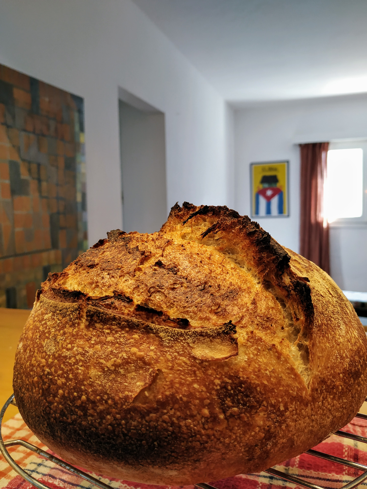
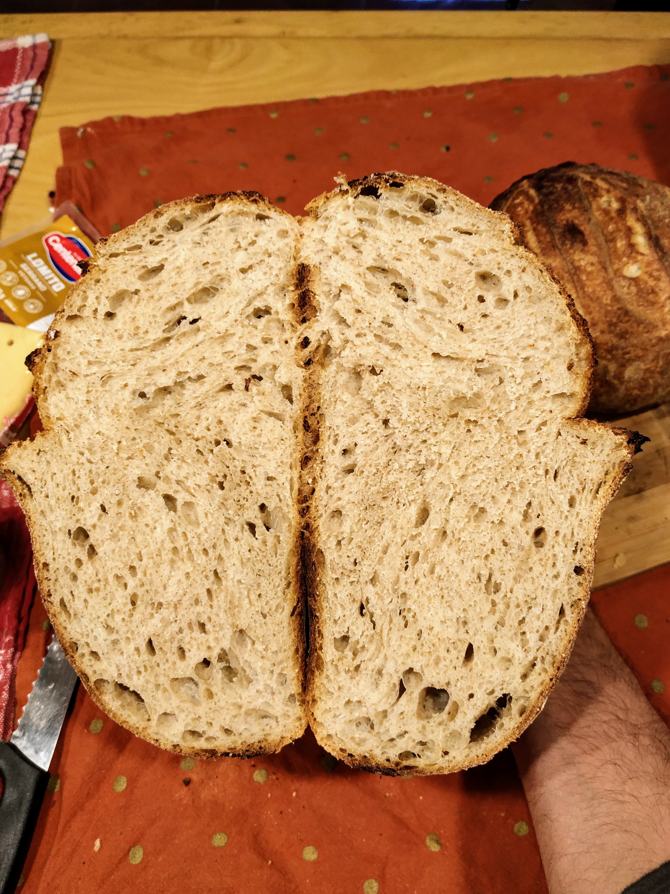
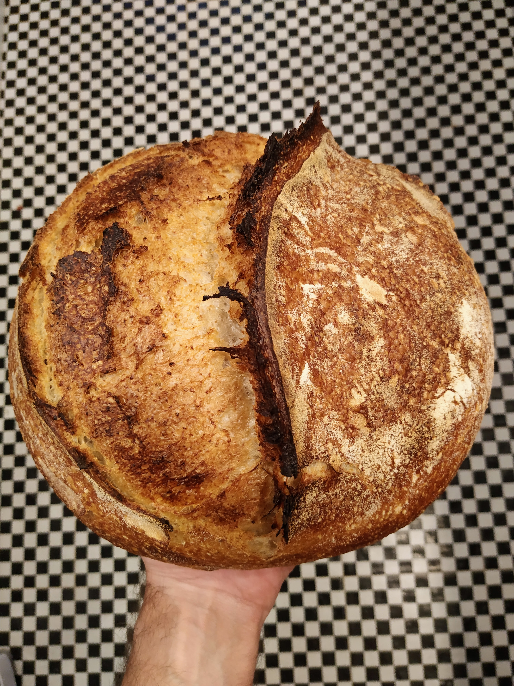

Bueno, creo que acabo de encontrar el santo grial de las recetas de pan. Y como me salió instagrameable este post va con muchas fotos.

### Lunes

El fin de semana estuve lejos de mi cocina así que el lunes saqué la masa madre de la heladera y la alimenté como siempre. Me han preguntado como es exactamente este tema porque genera confusión: yo saco 100gr de MM del frasco que tengo en la heladera y lo pongo en otro recipiente mucho más grande (tengo una cubeta de esas de plástico para poner botellas en hielo). A partir de ahí todo lo hago en ese recipiente. Después de hacer las recetas limpio mi frasco de MM (porque tengo nueva y más activa, entonces si quedó algo en el frasco de la heladera lo tiro) y guardo allí 100 o 200gr de la MM que usé para las recetas. Ahora sí? 👌

### Martes
Bueno el Martes tocó ir a la oficina así que volví a alimentar la masa madre muy temprano (limpié el recipiente de plástico dejando solo 100gr de MM antes de poner el resto). Lo que sobra se tira (da tristeza si pero...) o hay en internet muchas recetas para usar los descartes. Este paso es la pre-receta y las cantidades aparecen en la primer tabla más abajo. Como me levanté aventurero y había leído por ahí que el centeno es la droga de las levaduras cambié 50gr de integral por 50gr de centeno.

#### 8hs después...

Sigo en instagram a un [panadero](https://www.instagram.com/leocorbo_baker/) con panes envidiables 😏 así que decidí hacer una receta de una pan con centeno de pura masa madre que había guardado de él. Todos los detalles están más abajo pero lo interesante es que la proporción de agua en la masa final es menor a otras recetas que he hecho. Fue más difícil integrar todo pero la masa tiene gran consistencia final. Y promete …

### Miércoles

Madrugar, precalentar el horno y bum. La receta de Leo produce 1.7 kilos de masa. Ayer la dividí en dos partes, una de 1.2k que puse en el molde redondo grande y una de 0.5k que fue a un molde rectangular chico (molde..., puede ser un canasto de mimbre, un tupper, un bowl, la joda es tratar de que se escape la humedad, si son cerrados abajo pueden poner un poco de diario, una tela, harina y el pan). Hice el grande en la olla de hierro y el chico en la bandeja común del horno. El de la olla llevó 30 minutos tapado, y 10 más sin tapa. El chiquito llevó 30 minutos pero le volqué un vaso de agua en una bandeja abajo del horno para que la corteza no se haga demasiado rápido (dentro de la olla pasa lo mismo pero es la humedad del pan la que logra el efecto).

Y bueno yo diría que lo logramos:

### Conclusión
Bueno el cambio en la hidratación de la receta hace más difícil integrar los ingredientes y hacer los pliegues, además si bien la miga queda aireada y esponjosa no tiene las burbujas enormes esas de las otras recetas. El beneficio es que no pierde forma al salir del molde, por lo tanto crece mucho verticalmente y permite hacer buenos cortes que tienen ese resultado dramático en las fotos 🤤. 

Habrá que seguir experimentando.

