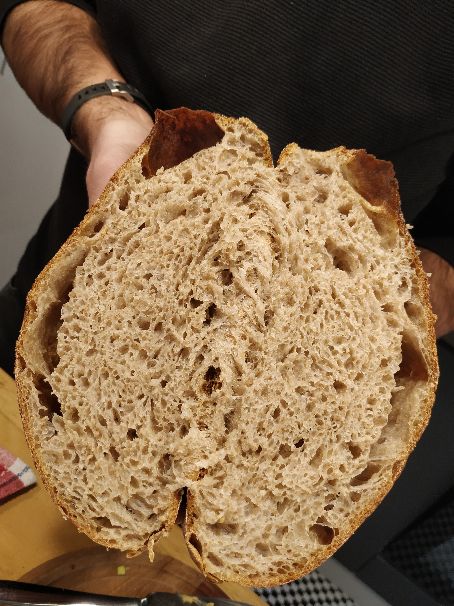
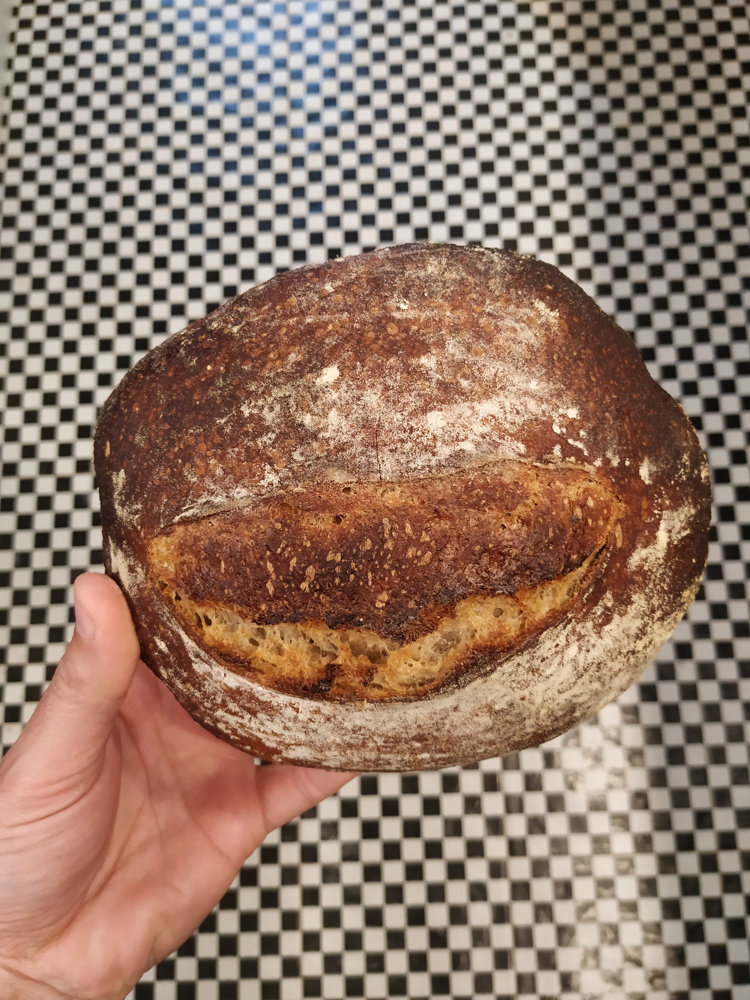

## Hoy

Son las 11 de la mañana, hay 15 grados en Montevideo y acaban de salir del horno tres pancitos muy dignos.
La receta es de Ken, tal cual la hice la última vez. Esta mezcla de harina blanca, integral y centeno es sabrosa e interesante (?), no muy ácido, y riquísimo.
Hace un tiempo vengo horneando en una olla de hierro (un pan a la vez) pero esta vez decidí hornear también en bandeja para ver las diferencias.

El pan grande va an una olla de hierro adentro del horno, 30 minutos con tapa, 10 sin tapa a 250 grados. Los otros fueron al mismo tiempo en la bandeja, sin olla, y con un poco de agua en la bandeja de abajo, les llevó menos tiempo, unos 35 minutos en total.

El grande quedó como es habitual, corteza fina y crocante (no le hice el tajo de arriba porque el señor de la receta no lo hace y quién soy yo para discutir, además quedan lindos redonditos, se nota la burbuja de arriba en la primera foto), de lo mejorcito que he hecho. 
Los chicos quedaron bien, corteza mucho más gruesa, pero a estos sí les hice un tajo (porque me pareció nomás) y quedaron como sonriendo. La ventaja de los chicos es que son más fáciles de guardar o regalar.

## Ayer

Ayer también hubo 15 grados, para la preparación usé agua del calefón calentita. Arranqué temprano alimentando nuevamente la masa madre y amasé como a las 16.
Después de todos los pasos que están detallados más abajo separé la masa.
La mitad de la masa fue a un molde grande redondo y las otras dos mitades a dos moldes más chicos.

##Notas##

Cuando paso la masa madre a la mezcla lo hago poniendola en un recipiente con agua para medir bien el peso. Al pasarla viene un poco de agua de ahí, supongo que podría medir cuanta agua extra estoy agregando y descontarla de la cantidad inicial. Importará?
