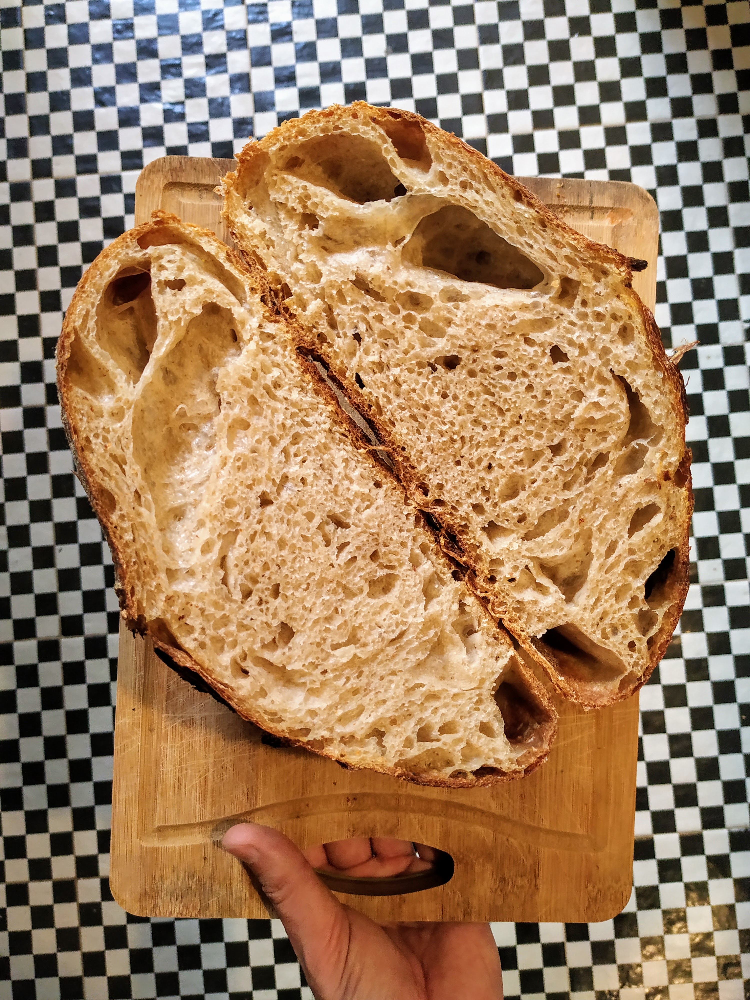
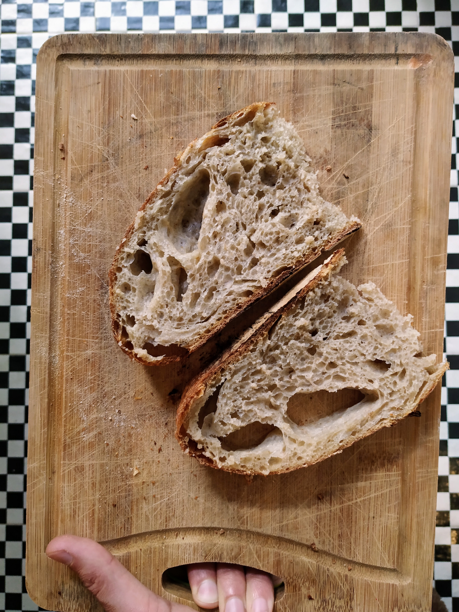
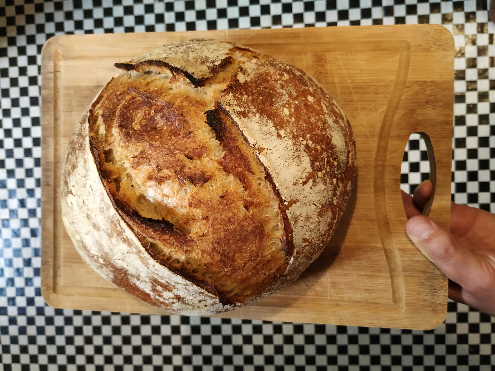
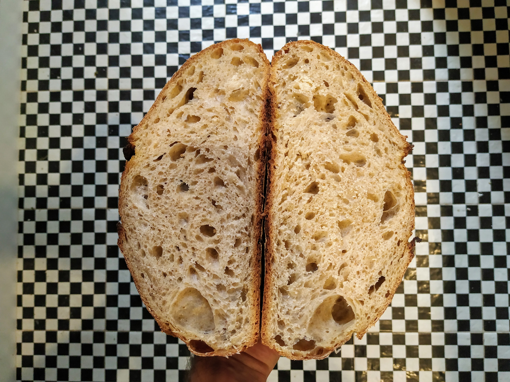

Este pan es una variación del Pan de Centeno que [había salido muy bien](/recetas/pan-centeno-pura-mm/). La pregunta es hasta dónde puedo aumentar la hidratación sin que sea todo un desastre. A medida que aumenta la cantidad de agua, los ingredientes son más fáciles de integrar pero la masa es más difícil de manejar y el riesgo que se desplome al salir del molde aumenta.

## Prueba 1

En este caso fuí de 67% a 72% de hidratación (este es el porcentaje de agua sobre la cantidad total de harina, la masa madre aporta 56% de harina y 44% de agua [ver acá](/recetas/integral-de-pura-mm/)). Cada punto % de agua cambia bastante las cosas, esta masa estuvo complicada y cuando la pasé del molde a la olla empezó a desplomarse enseguida. Me costó hacerle el corte de arriba porque estaba apurado intentando que no cayera del todo.

Finalmente creció bastante digno, pero no explotó. Adentro sin embargo...

Se nota el cambio en la miga, el gusto es difícil de comparar pero está muuuy rico 

## Caso 2

Acá fuí de 67% a 70% de hidratación, la receta es exactamente la misma de abajo pero en lugar de 356gr de agua puse 340gr. Este fue mucho más fácil de manejar que el otro y al salir del molde mantuvo su forma y me dejó hacer el corte tranquilo.

El resultado es mucho mejor del lado de afuera:

Y no está nada mal del lado de adentro:

Creo que esta segunda versión tiene lo mejor de los dos mundos, una buena corteza abierta y una miga con burbujas.

## Conclusión

Al parecer a estos niveles de hidratación empieza a importar cada vez más la harina. En particular su porcentaje de proteína. Las normales tres ceros tienen 5%, y encontré una dos ceros con 5.8%. Pero, los monstruitos estos de otros países manejan harinas con 12% o 14%.

En estos panes mezclé en partes iguales harina tres ceros y dos ceros pero antes de seguir echando agua me parece que voy a conseguir harinas más poderosas.
